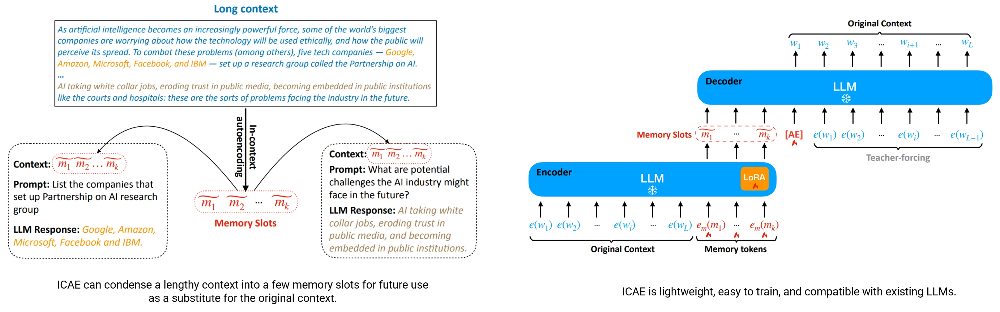

# DEPRECATED
## 📊 Score Calculation Overview

This section provides an overview of how challenge items are created for training a token compressor for large language models (LLMs), the purpose of each task, and how scores are calculated. The goal is to compress long contexts into shorter tokens while ensuring the integrity and usefulness of the output.

1. [Challenge Item Creation](#challenge-item-creation)
    - [Datasets Used](#datasets-used)
    - [Challenge Generation Process](#challenge-generation-process)
2. [Purpose of Each Task](#purpose-of-each-task)
    - [Question Answering Task](#question-answering-task)
    - [Continual Conversation Task](#continual-conversation-task)
    - [Reconstruction Task](#reconstruction-task)
3. [Score Calculation](#score-calculation)
    - [Criteria Used](#criteria-used)
    - [Scoring Methods](#scoring-methods)
    - [Rating Groups](#rating-groups)
    - [Tier System](#tier-system)

Firstly, I want to credit [In-context Autoencoder](https://github.com/getao/icae) for the inspiration and the paper of token compressing.

<div align="center">

</div>

### Challenge Item Creation for Synthetic

**Preview:** https://huggingface.co/datasets/Condense-AI/synthetic-samples-v0.1

<div align="center">

</div>

This dataset is generated by challenge generating in the subnet.
To reproduce it, please run:
```bash
git clone https://github.com/condenses/neural-condense-subnet
pip install -e .
cd neural_condense_subnet
python tests/test_synthetic.py
```

Console Output:
```
Benchmark Summary:
Error count: 0
Error rate: 0.00%
Average processing times (seconds): {'question_answering': 0.024009417057037352, 'reconstruction': 0.0036168951988220215, 'continual_conversation': 0.004922831296920776}

Context length statistics:
Mean: 10116.86 characters
Standard Deviation: 86.42 characters
```

#### Datasets Used

The challenge items are created using a combination of datasets to simulate real-world scenarios:

| Dataset Type | Datasets Used |
|--------------|---------------|
| Context Seeds | FineWeb-Pro and other context datasets loaded via `load_context_datasets()` |
| Conversation Seeds | Infinity Instruct, Open Math Instruct, and other instruction datasets loaded via `load_instruct_datasets()` |
| Cached Examples | Condense-AI/subnet-synthetic-dataset-v0.2 |

#### Challenge Generation Process

The challenge generation system consists of three main components:

1. **ConvoGenerator**: Handles the generation of conversations and QA pairs using an LLM API
2. **Scheduler**: Manages queues of pre-generated challenges using Redis
3. **ChallengeGenerator**: Creates the final challenge items in the correct protocol format

The process involves:

1. **Queue Management**:
   - Pre-fills Redis queues with cached examples from subnet-synthetic-dataset-v0.2
   - Continuously refreshes queues to maintain a steady supply of challenges
   - Monitors queue sizes and generates new items when needed

2. **Challenge Types**:
   - `question_answering`: QA pairs embedded within conversations
   - `causal_conversation`: Natural flowing conversations
   - `reconstruct_conversation`: Tests ability to reformat conversations
   - `trivial_qa_conversation`: Fill-in-the-blank style questions

3. **Protocol Creation**:
   - Inserts special tokens (`<START-ACTIVATE-TOKEN>`, `<END-ACTIVATE-TOKEN>`)
   - Formats context, activation prompt, and expected completion
   - Applies chat template using the provided tokenizer

### Purpose of Each Task

The system supports four main task types:

#### Question Answering Task

**Objective**: Test comprehension of context and ability to answer specific questions.

- **Process**:
  - Generates QA pairs from context using LLM
  - Embeds QA within larger conversations
  - Number of QA pairs controlled by `n_qa_per_context` (default: 4)

#### Causal Conversation Task

**Objective**: Test ability to maintain conversation flow and context.

- **Process**:
  - Uses conversation seeds from instruction datasets
  - Generates additional turns using LLM
  - Controls conversation length with `max_turns` parameter

#### Reconstruction Task

**Objective**: Test ability to reformat conversations while maintaining content.

- **Process**:
  - Takes existing conversation
  - Requires reformatting into specific template:
    ```
    [Role]: [Message]
    Example:
    - User: Hello, how are you?
    - Assistant: I am fine, thank you.
    ```

#### Trivial QA Task

**Objective**: Test basic comprehension with fill-in-the-blank questions.

- **Process**:
  - Selects sentence from conversation
  - Creates blank with surrounding context
  - Expects exact completion of missing text
### Score Calculation

#### Criteria Used

Scores are calculated based on perplexity and ELO ranking in batched competitions:

| Criteria | Description |
|----------|-------------|
| Perplexity | Measures how well the model predicts the expected completion tokens, with lower values indicating better performance |
| ELO Rating | A relative rating system that adjusts based on performance against other miners in the batch |

#### Scoring Method

1. **Perplexity Calculation**:
   ```python
   # Lower perplexity = better performance
   perplexity = exp(-1/N * Σ log P(token_i))
   ```

2. **Batch Competition**:
   - Miners are grouped into batches of size `BATCH_SIZE` (default: 4)
   - Each batch competes on the same challenge
   - Performance is relative within the batch
   - Groups are formed based on ELO ratings to ensure fair competition

3. **ELO Rating Updates**:
   ```python
   # K-factor varies based on rating tier:
   # - Beginner (0-800): K=24
   # - Intermediate (800-1600): K=16
   # - Advanced (1600-3000): K=4
   
   expected_score = 1 / (1 + 10^((opponent_rating - player_rating)/400))
   new_rating = current_rating + K * (actual_score - expected_score)
   ```

4. **Accelerator Rewards**:
   Additional rewards are calculated based on:
   ```python
   compress_rate = 1 - len(compressed_tokens) / max_condensed_tokens
   process_time = 1 - process_time / timeout
   accelerator = max(0, (compress_rate + process_time) / 2)
   ```

#### Rating Groups

Miners are divided into ELO rating groups that affect their K-factor:

| Group | Rating Range | K-factor |
|-------|-------------|----------|
| Beginner | 0-800 | 24 |
| Intermediate | 800-1600 | 16 |
| Advanced | 1600-3000 | 4 |

#### Tier System

Each tier has specific configuration and incentive percentages:

| Tier | Incentive % | Max Tokens | Context Length |
|------|-------------|------------|----------------|
| Research | 100% | 1024 | 10,000 chars |
| Inference 0 | 0% | 1024 | 15,000 chars |
| Inference 1 | 0% | 2048 | 20,000 chars |

### Configuration

The challenge system is configured through constants:

```python
SYNTHETIC_TASK_CONFIG = [
    {
        "task": "causal_conversation",
        "criterias": ["perplexity"],
        "rewarding_frequency": 1,
        "weight": 1,
    },
    // ... other tasks ...
]
```

Each tier has specific configuration for context length and token limits:

```python
TIER_CONFIG = {
    "research": {
        "max_context_length_in_chars": 10000,
        "max_condensed_tokens": 1024,
        "min_condensed_tokens": 128,
        // ... other settings ...
    },
    // ... other tiers ...
}
```

### Summary

The token compression challenge is designed to rigorously test the token compressor's effectiveness in various scenarios by:

- Using diverse datasets to simulate real-world inputs.
- Creating tasks that challenge different aspects of comprehension and context retention.
- Calculating scores based on LM metrics (perplexity,...) and ELO rating.

By understanding how the challenge items are created, the purpose behind each task, and the scoring methodology, developers can better train and evaluate token compressors for LLMs.

